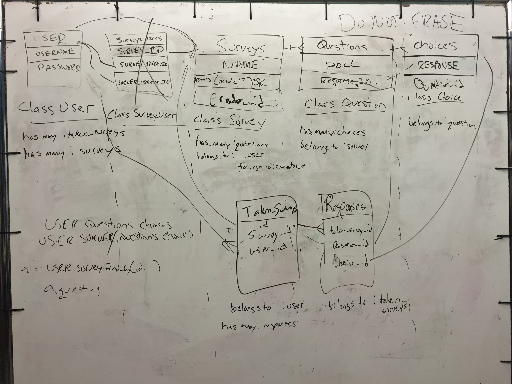
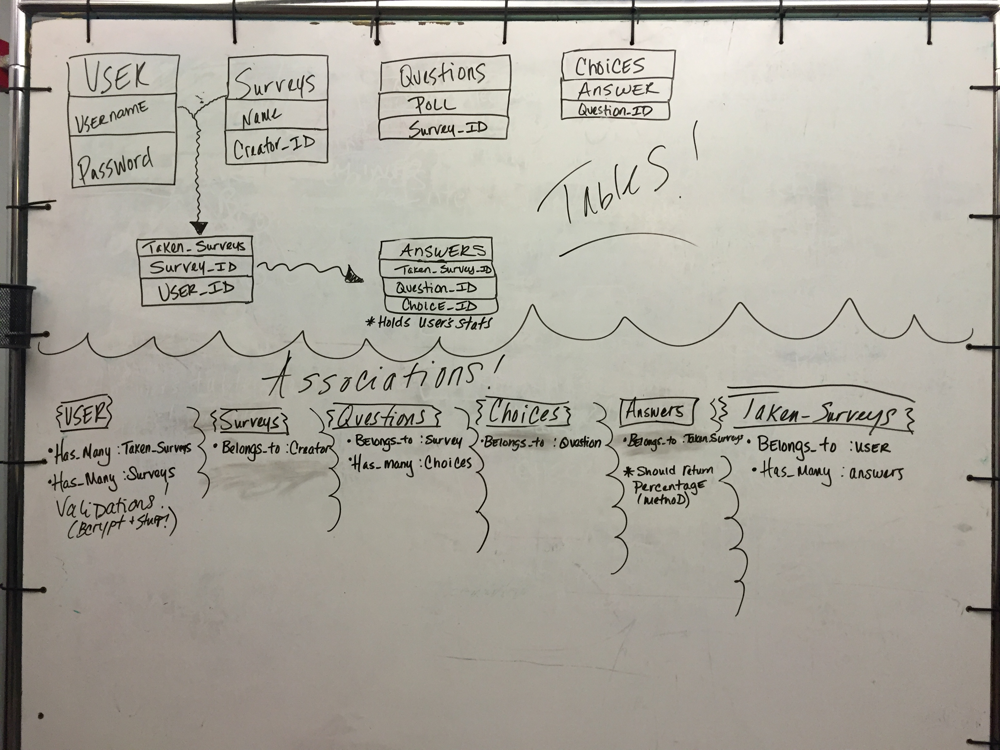
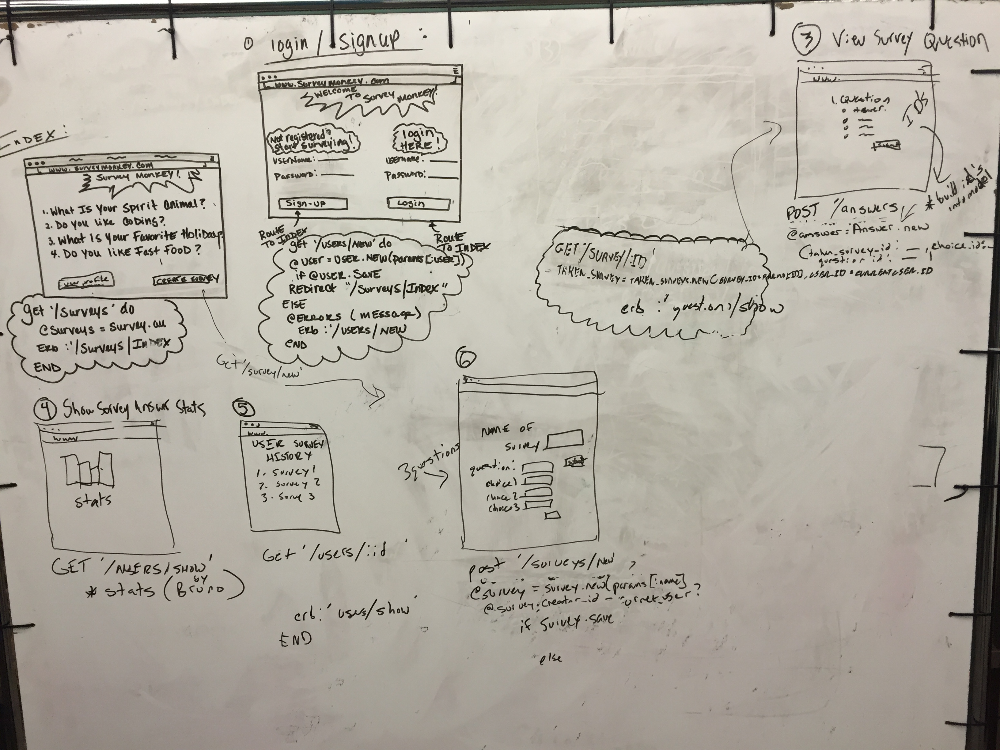

# GorillaZ
## Team members:
Bruno

Chris

Courtney

Will

## MVP Description:
Current project status allows for a user to arrive at the main landing page where they have the option of creating an account or signing in. Once signed in a user has a profile page detailing the surveys completed as well as options to complete another survey or create their own. Once a survey is completed the user is prompted with a stats page detailing how their answers compare to others who have taken the same survey.

## Trello:
https://trello.com/b/IJFNWA13/to-do

## Wireframes:

## Team Dynamics
We began with a full team meeting in order to plan our schema, wireframes, and base functionality. Once the project had been broken down into features and their corresponding user stories we broke into pairs. Commits were checked between pairs with any merges being done by the other duo once the code had been checked. We maintained open communication with direction and implementations done through a group consensus.

## Resources
#####Amazing resources to get us started on forms
http://blog.learntoprogram.tv/creating-a-survey-form-in-html/
